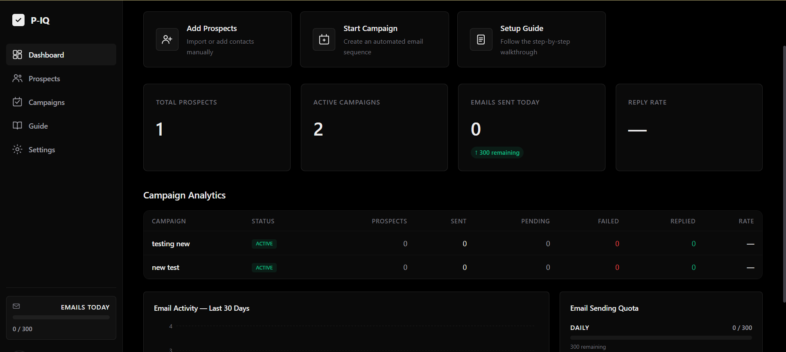
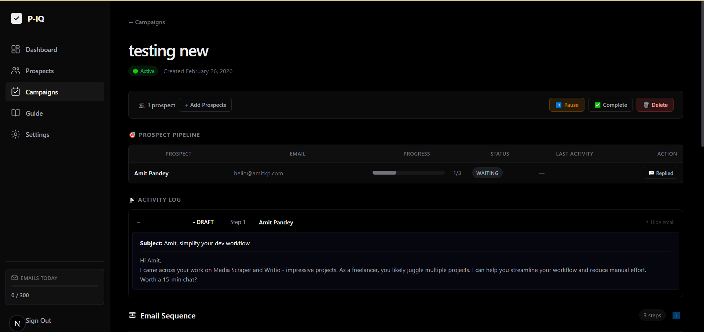
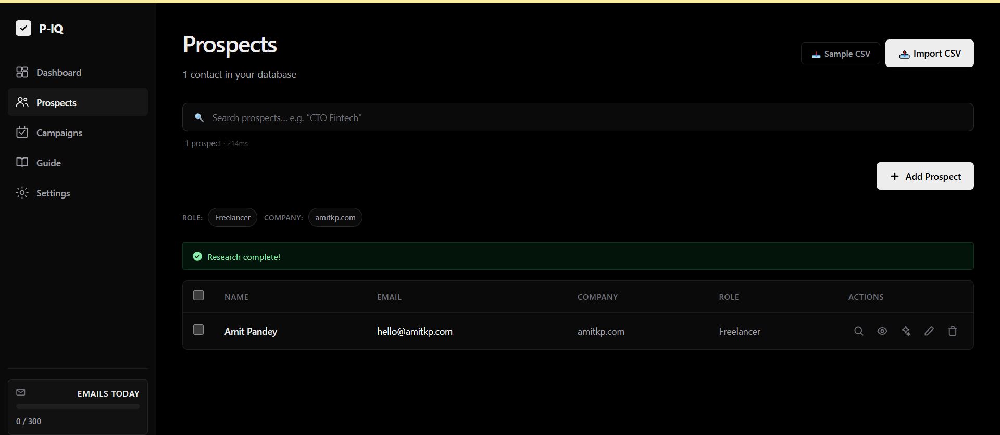
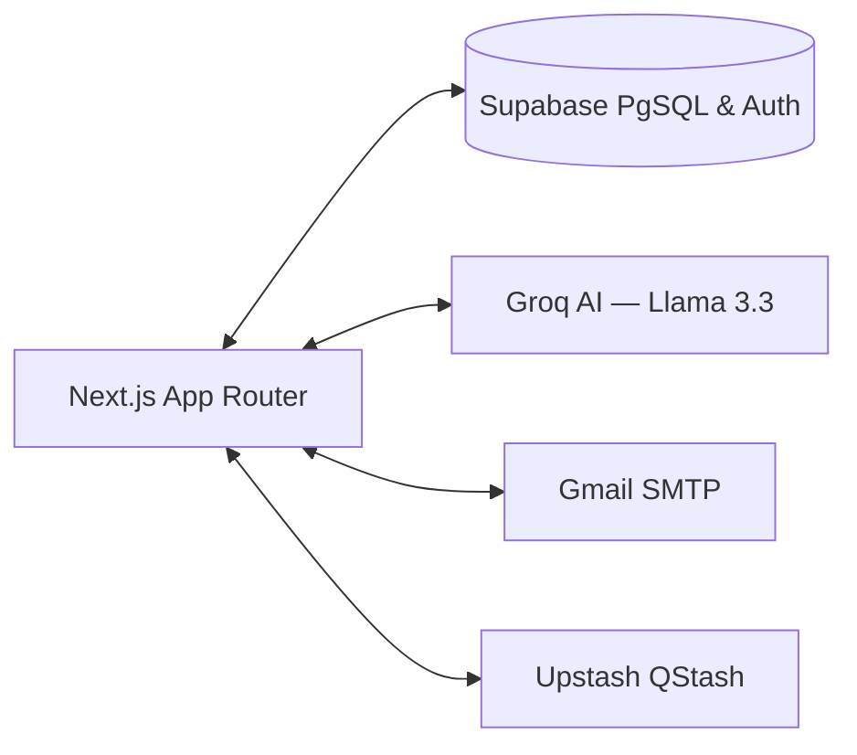

# ProspectIQ

**AI-driven discovery and outreach engine.** Find, enrich, and contact potential leads at scale using automated, highly personalized email sequences — powered by Llama 3.3 and delivered from your own Gmail.

---

## Screenshots

| Dashboard | Campaign Builder | Prospects |
|:---------:|:----------------:|:---------:|
|  |  |  |

---

## Purpose

The modern outreach process is broken — generic emails get ignored, and manual personalization doesn't scale. ProspectIQ bridges this gap by automatically researching prospects and using AI (Llama 3.3 via Groq) to craft hyper-relevant messages that actually get replies, sent securely from your own connected Gmail account.

## Features

- **Prospect Management** — Store, organize, and search your contacts with bulk CSV import support.
- **Automated Enrichment** — Scrape prospect company websites to gain valuable talking-point context.
- **AI Email Generation** — Draft personalized emails based on prospect data and enrichment context in seconds.
- **Campaign Sequences** — Create multi-step drip campaigns with configurable delays and follow-ups.
- **Email Approval Workflow** — Optionally review and approve AI-generated emails before they're sent.
- **Bring Your Own Email** — Send campaigns directly through your Google Workspace / Gmail account via SMTP App Passwords.
- **Built-in Analytics** — Track prospects, sent emails, and reply rates from a sleek dashboard.

## Tech Stack

| Layer | Technology |
|-------|-----------|
| **Frontend** | Next.js 15 (App Router), React 19, Tailwind CSS v4 |
| **Backend** | Next.js Server Actions & API Routes |
| **Database & Auth** | Supabase (PostgreSQL + Row Level Security) |
| **AI** | Groq (Llama 3.3 70B) — sub-second inference |
| **Email** | Nodemailer (Gmail SMTP with App Passwords) |
| **Scheduler** | Upstash QStash (serverless cron & delayed jobs) |

### System Architecture

## What's Built vs. Roadmap

**✅ Shipped**
- Prospect database with CRUD, search, filters, and multi-select
- CSV bulk import with column mapping and validation
- Background website scraping & content extraction for enrichment
- One-click personalized email draft generation via Llama 3.3
- Multi-step campaign builder with timeline UI
- Automated delay sequences managed by serverless QStash
- Optional email approval workflow (review before send)
- Gmail SMTP integration for authentic deliverability
- Analytics dashboard with charts and quota tracking

**🚧 Planned Next**
- Team collaboration and multi-seat workspaces
- Advanced analytics drill-down (open rates, link tracking)
- Universal mailbox OAuth integrations (Google / Microsoft)
- A/B testing for email subject lines

## Results & Impact

- **1,000+ prospects** processed seamlessly through the automated enrichment pipeline.
- **500+ personalized email drafts** generated, saving ~40 hours of manual research.
- **Sub-second AI generation** by leveraging Groq's high-speed inference hardware.

## Getting Started

1. **Clone the repository**
2. **Install dependencies:** `npm install`
3. **Set up environment variables:** Copy `.env.example` → `.env` and fill in your Supabase, Groq, QStash, and SMTP credentials.
4. **Run the dev server:** `npm run dev`
5. **Open your browser:** Navigate to `http://localhost:3000`

## License

MIT
